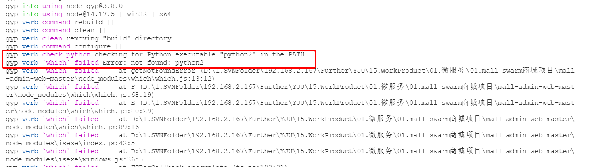

# 常见问题

>记录一些开发过程中和项目部署常见的问题

## 前端

### mall-admin-web-master\node_modules\node-gyp\gyp\gyp_main.py': [Errno 22] Invalid argument

**本地环境：**

`nodejs v14.17.5`

`python v2.7`

`"node-sass": "^4.13.0"`

**问题发现：**

从github上拉下了一个前端项目*mall-admin-web-master*，执行`npm install`时，控制台输出上述错误

**问题关键点：**

>网上大多数解决方案都是node-sass与node版本不兼容，node降版本或者node-sass升版本。还有部分解决方案是安装python2.7和下载node-gyp`npm install -g node-gyp`

找到log中首个错误，不要只看红色的Err部分，第一次看的时候就忽略掉了下图红圈标识的错误！


**问题解决：**

执行`npm config set python python2.7`后重新安装

## 项目部署

### Error response from daemon: driver failed programming external connectivity on endpoint nginx

**本地环境：**

Docker version 20.10.11

**问题发现：**

部署前后端分离部署时，执行`docker start nginx`启动失败

**问题关键点：**

**问题解决：**

`systemctl restart docker`重启docker后再次执行命令`docker start nginx`启动成功

### Docker使用nginxAPI反向代理解决跨域问题，connect() failed (113: No route to host) while connecting to upstream

**本地环境：**

Docker version 20.10.11

Nginx 1.21.4

**问题发现：**

采用nginx代理的方式部署前端项目，API部分想通过nginx转发到对应的地址
配置内容如下:

```config
location /api {
  proxy_pass http://192.168.1.101:8008;
}
```

**问题关键点：**

1. 首先要确认你修改的配置文件是否已经挂载到Docker内的nginx容器上

2. 通过浏览器的F12 network功能无法看到代理后的url地址，只能看到请求发出时url，可以通过nginx的log文件**error.log**查看，这个文件主要用来确认我们代理之后的url是否复合我们预期

3. 通过error.log中确认代理后的路径也正确，最后发现是后台程序没有启动好，因为最开始在url上直接输入完成的API请求路径，返回405method类型不匹配（API中method定义的是post）认为后台是可以访问到的，就排除掉了后台的问题
