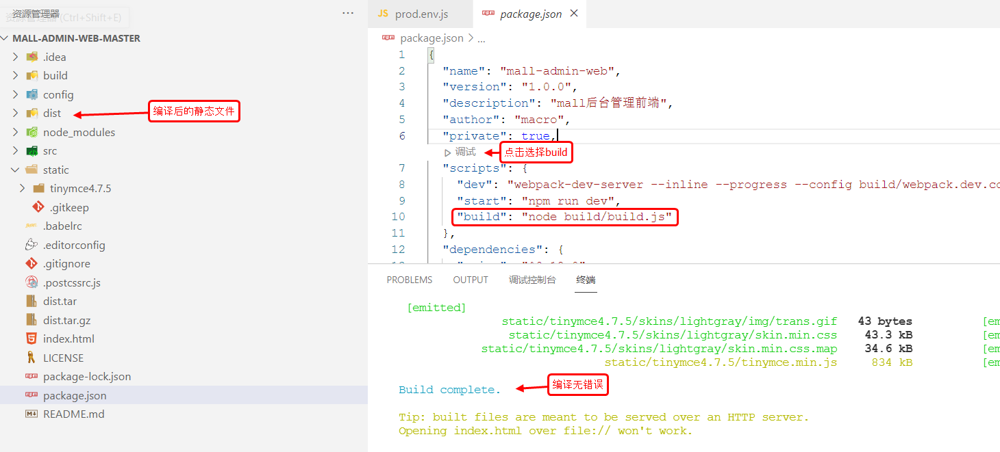

# Vue项目环境部署

## Windows下的安装及部署

1. 控制台安装依赖`npm install`

2. 启动前台工程`npm run dev`

3. 在vscode中启动方式如下图：

## Linux下的安装及部署

1. 项目目录下cmd输入`npm run build`

2. 编译成功后生成默认会在根目录下生成**dist**文件夹

3. 在vscode中编译方式如下图：

4. 编译成功后，将**dist**文件压缩成**dist.tar.gz**，如果生成文件不大不想压缩，该步骤可忽略

5. 将**dist.tar.gz**上传到linux服务器（nginx相关目录）

6. 解压文件`tar -zxvf dist.tar.gz`

7. 删除nginx的html文件夹 `rm -rf html`

8. 移动dist文件夹到html文件夹 `mv dist html`

9. 重启nginx`docker restart nginx`

10. 访问ip即可`http://192.168.x.xxx`

## Linux下部署多个前端项目

TODO

## 使用Docker一键发布

