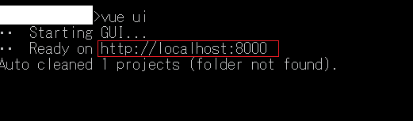
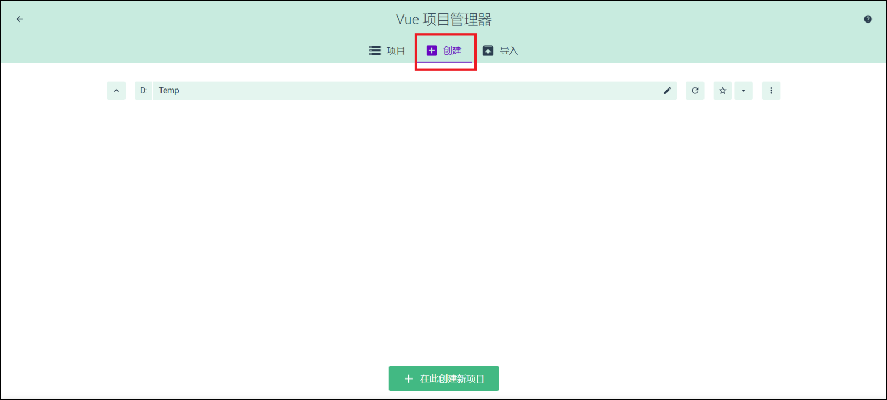
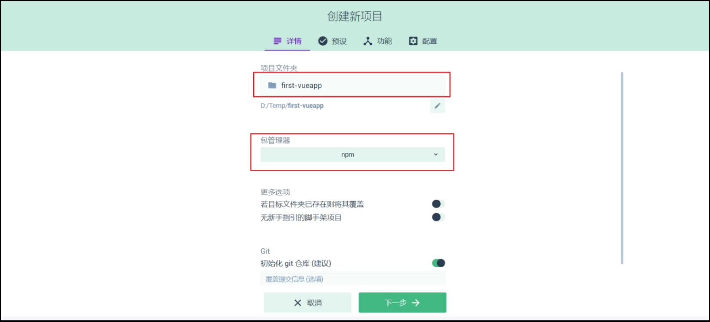
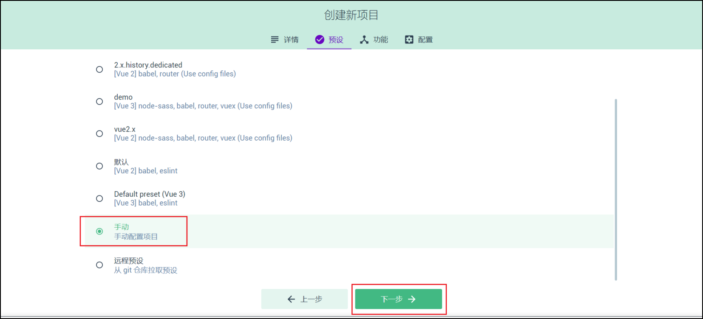
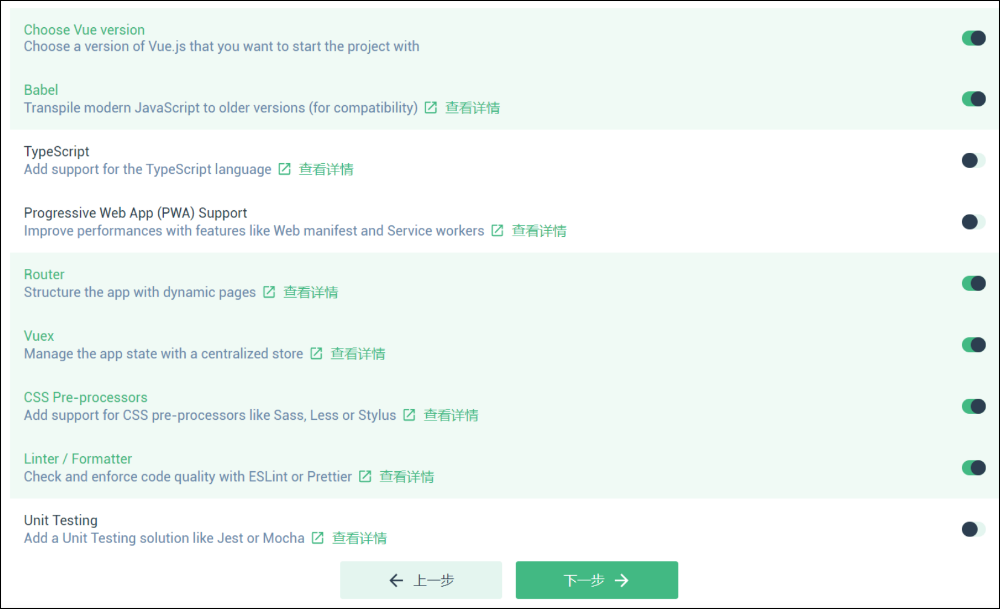
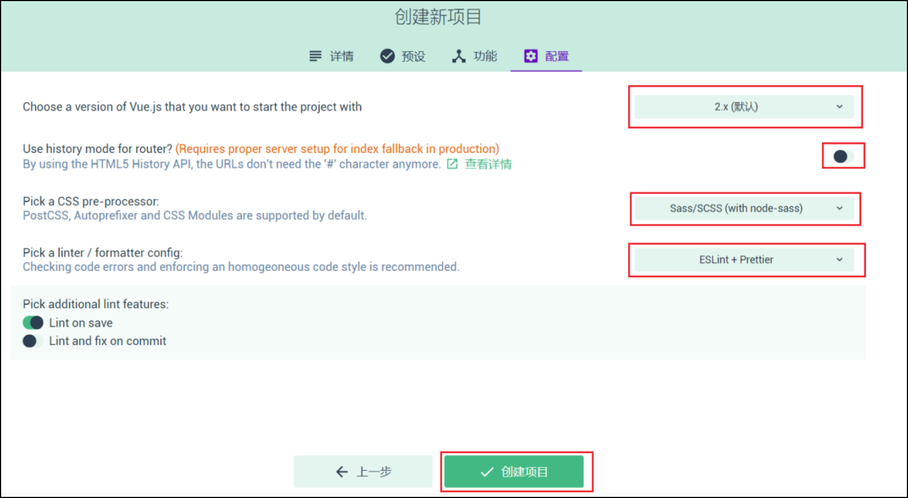

# 环境部署

## 安装nodejs

- [官网下载](http://nodejs.cn/download/current/) 安装完成后cmd输入`node -v`即可验证是否安装成功

## 安装Visual Studio Code

- vscode是一个前端开发工具，相较于市面主流的开发工具webstorm、HBuilder。免费、轻量、插件丰富是它的优势
- [官网下载](https://code.visualstudio.com/Download)
- 推荐使用的插件列表
  - Auto Close Tag
  - Auto Import
  - Auto Rename Tag
  - Beautiful
  - Eclipse Keymap
  - GitLens
  - HTML CSS Support
  - Prettier
  - Code formatter
  - Stylelint
  - Vetur
  - vscode-icons
  - vscode-element-helper
  - markdownlint

## 离线搭建vue项目

1. 在可联网的环境中，用脚手架工具创建vue项目，创建完成后，执行`npm install`
2. 将已安装好的项目拷贝至离线环境下使用
3. [demo项目链接](svn://192.168.2.167/Further/YJU/20.Environment/02.Vue/demo)

## 安装vue脚手架

1. 推荐安装新版本(自带vue ui) cmd输入`npm install -g @vue/cli`
2. `vue -V`验证是否安装成功

<!-- ## 四、搭建vue项目环境(版本2.x)

1. 全局安装vue-cli：`npm install -global vue-cli`  
2. 使用**windows命令行**进入要创建项目的目录，基于webpack模板创建`vue init webpack 项目名`  
    - *Project name* `项目名字`
    - *Project description* `项目描述`
    - *Author* `作者`
    - *Vue build* `打包方式，回车即可`
    - *Install vue-router?* `是否要安装 vue-router，项目中肯定要使用到 所以Yes`
    - *Use EsLint to lint your code?* `是否需要js语法检测，目前我们不需要所以No`
    - *Set up unit tests?* `是否安装单元测试工具，目前我们不需要所以No`
    - *Setup e2e tests with Nightwatch?* `是否需要端到端测试工具，目前我们不需要所以No`
    - *Should we run \`npm install\` for you after project has been created?\<recommended\>?* `No`  
3. 进入项目：cd 项目名，安装依赖`npm install`安装成功后，项目文件夹会多出一个目录：`node_modules`  
**该步极易出现错误，如常见的python、node-gyp环境的依赖问题，具体问题具体分析**  
4. `npm run dev`启动项目  

### 目录结构(版本2.x)

1. build：构建脚本目录  
    1. build.js`生产环境构建脚本`  
    2. check-versions.js`检查npm，node.js版本`  
    3. utils.js`构建相关工具方法`
    4. vue-loader.conf.js`配置了css加载器以及编译css之后自动添加前缀`  
    5. webpack.base.conf.js`webpack基本配置`  
    6. webpack.dev.conf.js`webpack开发环境配置`  
    7. webpack.prod.conf.js`webpack生产环境配置`  
2. config：项目配置  
    1. dev.env.js`开发环境变量`  
    2. index.js`项目配置文件`  
    3. prod.env.js`生产环境变量`
3. node_modules：npm 加载的项目依赖模块
4. src：这里是我们要开发的目录，基本上要做的事情都在这个目录里。里面包含了几个目录及文件：  
    1. assets：资源目录，放置一些图片或者公共js、公共css。这里的资源会被webpack构建
    2. components：组件目录，我们写的组件就放在这个目录里面
    3. router：前端路由，我们需要配置的路由路径写在index.js里面  
    4. App.vue：根组件；
    5. main.js：入口js文件；
    6. static：静态资源目录，如图片、字体等。不会被webpack构建
    7. index.html：首页入口文件，可以添加一些 meta 信息等
    8. package.json：npm包配置文件，定义了项目的npm脚本，依赖包等信息
    9. README.md：项目的说明文档，markdown 格式
    10. xxxx文件：这些是一些配置文件，包括语法配置，git配置等 -->

## 搭建vue3.x项目环境(联网环境使用cmd)

1. 全局安装vue-cli：`npm install -g @vue/cli`
2. **cmd**执行命令`vue create 项目名`  
3. *Please pick a preset*
    - ~~Default([Vue 2]babel, eslint)~~
    - ~~Default([Vue 3]baebl, esline)~~
    - Manually select features  
4. _Check the features needed for your project_  
    (\*) Choose Vue version  
    (\*) Babel  
    ( ) TypeScript  
    ( ) Progressive Web App (PWA) Support  
    (\*) Router  
    ( ) Vuex  
    ( ) CSS Pre-processors  
    ( ) Linter / Formatter  
    ( ) Unit Testing  
    ( ) E2E Testing  
5. _Choose a version of Vue.js that you want to start the project with (Use arrow keys)_ 根据实际需求选择2.x或3.x，由于目前网络项目上2.x版本资料较多，我们选择2.x
    - 2.x
    - ~~3.x~~
6. _Use history mode for router_ 是否采用history的方式创建路由，我们选择Yes
7. _Where do you prefer placing config for Babel, ESLint, etc.?_ 将Babel, ESLint等其他选项独立放置还是放置在package.json中，我们选择独立放置  
    - In dedicated config files
    - ~~In package.json~~
8. _Save this as a preset for future projects?_ 是否将该配置作为以后的项目配置方式
9. _Save preset as_ 对该配置起一个别名  
10. 进入项目目录 命令行执行`npm run serve`

## 搭建vue3.x项目环境(联网环境使用vue ui)

1. cmd输入`vue ui`

    

2. 根据启动的端口号8000访问[vue ui](http://localhost:8000/project/select)
3. 创建新项目
4. 输入项目名并选择包管理工具
5. 选择手动配置项目
6. 勾选常用的模块包
7. 版本选择2.x、路由采用hash模式、选择css预处理器和代码格式化工具即可
8. 点击运行按钮，即可启动项目

## vue脚手架的卸载

1. 命令行执行`npm uninstall -g vue-cli`
2. 进入[本机目录](D:\\workbase\\nodejs\\node_global) 看看有无残略的vue文件，存在则删除  
