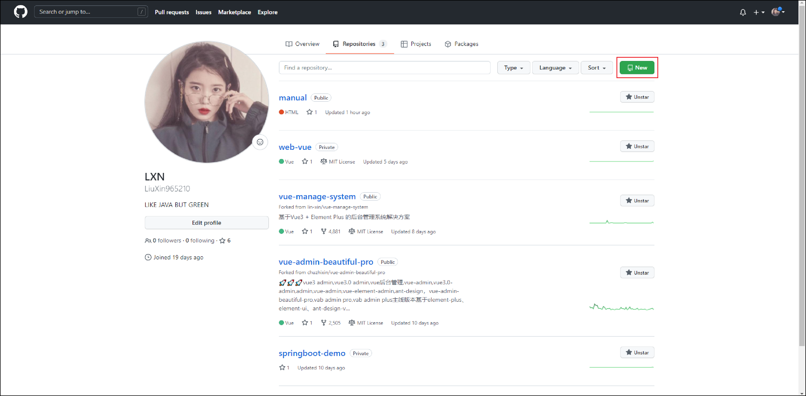
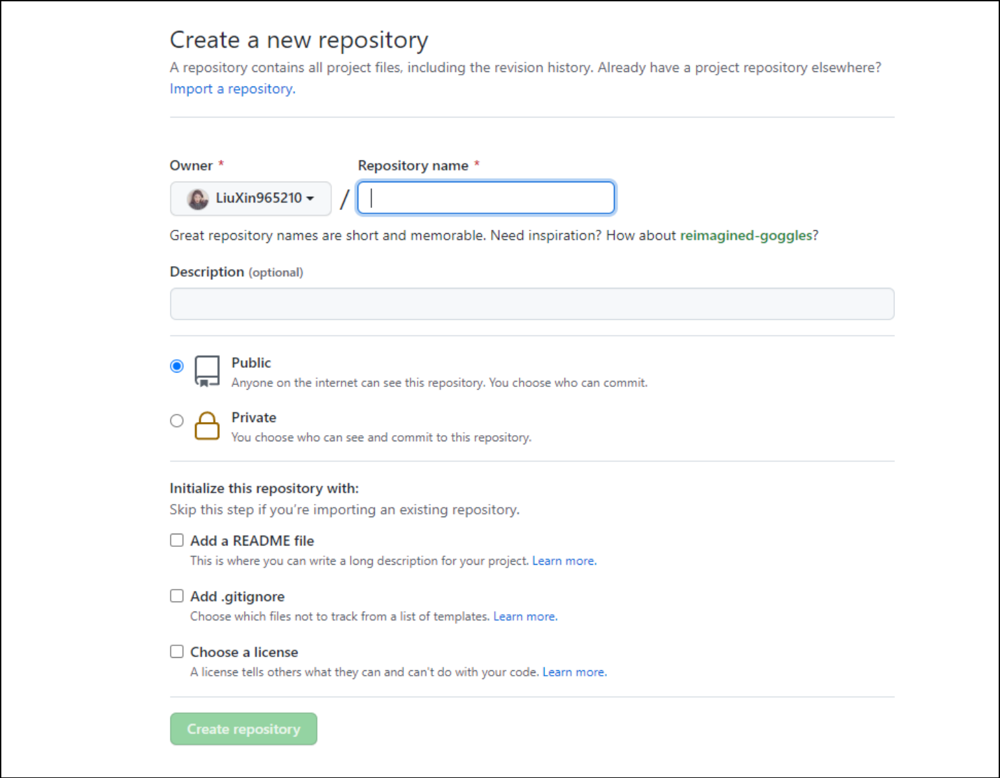

# Git的安装及使用

>Git 是一个开源的分布式版本控制系统，用于敏捷高效地处理任何或小或大的项目。Git 与常用的版本控制工具 CVS, Subversion 等不同，它采用了分布式版本库的方式，不必服务器端软件支持

## 常见命令

### 初期化git配置

`git config --global user.name author #将用户名设为author`

### 本地仓库文件上传

1. 项目目录下右键点击 **git bash here**

2. github上创建新仓库

3. 输入仓库名

4. 初期化.git文件`git init`

5. 提交文件至暂存区`git add ./`

6. 提交文件至仓库`git commit -m "提交的注释"`

7. 建议与远程仓库的映射关系`git remote add origin 地址`

8. 推送代码`git push -u origin master`

9. 输入用户名及密码

### 常见错误

#### fatal: unable to access xxx: OpenSSL SSL_connect: SSL_ERROR

`git config --global http.sslVerify "false"`

`git config --global --unset http.proxy`

`git config --global --unset https.proxy`
